[linkedin](https://www.linkedin.com/in/harshit-singh-7a209a282/) &nbsp;·&nbsp;
[leetcode](https://leetcode.com/harshitzofficial) &nbsp;·&nbsp;
[geeksforgeeks](https://www.geeksforgeeks.org/user/harshitunpa/) &nbsp;·&nbsp;
[email](mailto:harshit.official.281005@gmail.com)

> BTech student at Delhi Technological University. 
> Competitive Programmer | DSA Enthusiast.

Hello! I'm Harshit Singh, an enthusiastic techie passionate about 
building impactful full-stack solutions and helping others through 
technology and education.

- 🔭 &nbsp;Currently working on **Full Stack Projects**
- 🌱 &nbsp;Deep diving into **System Design & Cloud Architecture**
- 👨‍💻 &nbsp;Grinding **DSA** daily on LeetCode & GFG
- 💬 &nbsp;Ask me about <samp>react</samp>, <samp>node.js</samp>, <samp>c++</samp>, or <samp>system design</samp>
- ⚡ &nbsp;Fun fact: I debug faster with coffee ☕

<samp>react &nbsp; node.js &nbsp; c++ &nbsp; python &nbsp; javascript &nbsp; git &nbsp; linux</samp>

**Full Stack Web Apps** &nbsp;·&nbsp; <samp>react, node.js</samp> 
Currently working on building scalable full-stack applications.

**System Design** &nbsp;·&nbsp; <samp>cloud architecture</samp> 
Deep diving into advanced system design and cloud technologies.

 

&nbsp;

&nbsp;

  

<!-- Snake Contribution Animation -->
<picture>
  <source media="(prefers-color-scheme: dark)" srcset="https://raw.githubusercontent.com/harshitzofficial/harshitzofficial/output/github-contribution-grid-snake-dark.svg">
  <source media="(prefers-color-scheme: light)" srcset="https://raw.githubusercontent.com/harshitzofficial/harshitzofficial/output/github-contribution-grid-snake.svg">
  
</picture>

 

